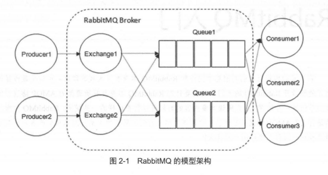
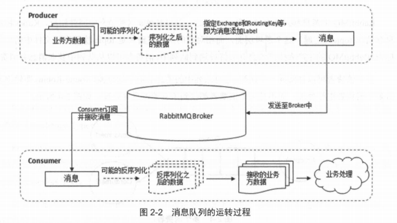
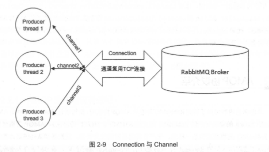

# RabbitMQ

由Erlang编写的实现了高级消息队列协议（Advanced Message Queuing Protocol，AMQP）规范的一种消息代理(Message Broker)服务器,开源。

```
RabbitMQ基于Erlang语言开发，该语言是20世纪80年代中后期由Ericsson计算机科学实验室设计的面向电信行业的函数式编程语言。Erlang被设计成一种分布式、高容错的软实时系统，用于构建99.999%可用性的应用系统。作为一种开发语言和运行时系统，Erlang专注于节点之间消息通信的轻量级进程，提供了状态无关的高并发性。
```

## 安装

### Linux


#### Docker

1.获取镜像(Latest)
```
docker pull rabbitmq:3-management(带管理界面)
docker pull rabbitmq
```
2.启动镜像
```
docker run -itd --rm --name rabbitmq -p 5672:5672 -p 15672:15672 rabbitmq:3-management
```
3.修改密码

先进入容器

```
docker exec -it rabbitmq bash
```

查看当前用户列表

```
rabbitmqctl  list_users  
```

修改密码

```
rabbitmqctl  change_password  guest  '123456'
```

## 介绍

### 特性与优点
- 开源
- 平台和供应商无关系
- 轻量级

### 相关概念介绍


RabbitMQ整体上是一个生产者与消费者模型，主要负责接受、存储和转发消息。从计算机术语层面来说，RabbitMQ模型更像是一种交换机模型。


#### 生产者和消费者

##### Producer

生产者，投递消息的一方。

生产者创建消息，然后发布到RabbitMQ中。消息一般可以包含2个部分：消息体和标签（Label）。

消息体也可以称之为payload（在实际应用中一般是一个带有业务逻辑结构的数据，比如JSON字符串）。

消息的标签用来表诉这条消息，比如一个交换器的名称和一个路由键。生产者把消息交由RabbitMQ，RabbitMQ之后会根据标签把消息发送给感兴趣的消费者。

##### Consumer

消费者，接受消息的一方。

消费者连接到RabbitMQ服务器，并订阅到队列上。当消费者消费一条消息时，只是消费消息的消息体（payload）。在消息路由的过程中，消息的标签会丢弃，存入到队列中的消息只有消息体。

##### Broker

消息中间件的服务节点。



##### 队列

RabbitMQ的内部对象，用于存储消息。RabbitMQ中消息都只能存储在队列中。

多个消费者可以订阅同一个队列，这是队列中的消息会被平均分摊（即轮询）给多个消费者进行处理，而不是每个消费者都收到所有的消息并处理。

##### 交换器

Exchange。实际上生产者将消息发送到Exchange，由交换器将消息路由到一个或多个队列中。

如果路由不到，会根据抛弃策略处理消息。

*交换器类型*

RabbitMQ常用的交换器类型有fanout、direct、topic、headers这四种。（AMQP协议里还提到了System和自定义

`fanout`

它会把所有发送到该交换器的消息路由到所有与该交换器绑定的队列中。

`direct`

它会把消息路由到那些BindingKey和RoutingKey完全匹配的队列中

`topic`

它会把消息路由到那些BindingKey和RoutingKey对应匹配规则的队列中

`headers`

headers不依赖路由键的匹配规则来路由消息，而是根据发送的消息内容中headers属性与绑定队列和交换器时指定的一组键值对进行完全匹配。

性能很差，也不实用，基本上不会看到它的存在。

##### 路由键

路由键。生产者将消息发给交换器的时候，一般会指定一个RoutingKey，用来指定这个消息的路由规则，而这个一般会指定一个RoutingKey需要与交换器类型和绑定键联合使用才能最终生效。

在交换器类型和绑定键固定的情况下，生产者可以在发送消息给交换器时，通过指定RoutingKey来决定消息流向哪里

##### 绑定

RabbitMQ中通过绑定将交换器和队列关联起来，在绑定的时候一般会指定一个绑定键，这样RabbitMQ就知道如何正确地将消息路由到队列了

##### Connection、Channel

无论生产者和消费者，都需要和Broker建立连接，这个连接（Connection）就是一条TCP连接。

TCP连接建立以后，可以创建一个AMQP信道，每个信道都会被指派一个唯一的ID。信道是建立在Connection上的虚拟连接，RabbitMQ处理的每条AMQP指令都是通过信道完成的。


##### 运转流程

*发送消息流程*

1. 生产者连接到RabbitMQ Broker，建立一个连接（Connection），开启一个信道（Channel）
2. 生产者声明一个交换器，并设置相关属性，比如交换机类型、是否持久化等
3. 生产者声明一个队列并设置相关属性，比如是否排他、是否持久化、是否自动删除等
4. 生产者通过路由键将交换器和队列绑定起来。
5. 生产者发送消息至RabbitMQ Broker，其中包含路由键、交换器等消息
6. 相应的交换器根据接收到的路由键查找相匹配的队列。
7. 如果找到，则将从生产者发送过来的消息存入相应的队列中。
8. 如果没有找到，则根据生产者配置的属性选择丢弃还是回退给生产者
9. 关闭信道、连接

*消费者接受消息过程*
1. 消费者连接到RabbitMQ Broker，建立一个连接（Connection），开启一个信道（Channel）
2. 消费者向RabbitMQ Broker请求消费对应队列中的消息，可能会设置相应的回调函数，以及做一些准备工作。
3. 等待RabbitMQ Broker回应并投递相应队列中的消息，消费者接受消息。
4. 消费者确认(ACK)接受到的消息。
5. RabbitMQ从队列中删除相应已被确认的消息。
6. 关闭信道、连接

*引入通道的意义*

类似NIO的做法，TCP连接复用，可以减少性能开销。


#### AMQP

AMQP高级消息队列（Advanced Message Queuing，AMQ）模型。
针对代理服务器软件，AMQ模型在逻辑上定义了三种抽象组件用于指定消息的路由行为：
- 交换器（Exchange），消息代理服务器中用于把消息路由到队列的组件。
- 队列（Queue），用来存储消息的数据结构，位于硬盘或内存中。
- 绑定（Binding），一套规则，用于告诉交换器消息应该被存储到哪个队列。

##### 交换器
一个交换器接收发送到RabbitMQ中的消息并决定把它们投递到何处。交换器定义消息的路由行为，通常这需要检查消息所携带的数据特性或者包含在消息体内的各种属性。

RabbitMQ拥有多种交换器类型，每一种类型具备不同的路由行为。另外，它还提供了一种可用于自定义交换器的插件架构。

##### 队列

队列负责存储接收到的消息，同时也可能包含如何处理消息的配置信息。队列可以把消息只存储在内存中，也可以存储在硬盘中，然后以先进先出（FIFO）的顺序进行投递。

##### 绑定

##### 通信

AMQP把客户端和代理服务器之间的通信数据拆分成了一种叫做帧(frame)的块机构，

AMQ模型使用绑定（binding）来定义队列和交换器之间的关系。在RabbitMQ中，绑定或绑定键（binding-key）即告知一个交换器应该将消息投递到哪些队列中。对于某些交换器类型，绑定同时告知交换器如何对消息进行过滤从而决定能够投递到队列的消息。

当发布一条消息到交换器时，应用程序使用路由键（routing-key）属性。路由键可以是队列名称，也可以是一串用于描述消息、具有特定语法的字符串。当交换器对一条消息进行评估以决定路由到哪些合适的队列时，消息的路由键就会和绑定键进行比对（见图1.10）。换句话说，绑定键是绑定队列到交换器的粘合剂，而路由键则是用于比对的标准。
## 入门实例
1.依赖
```
<dependencies>
    <dependency>
        <groupId>org.springframework.boot</groupId>
        <artifactId>spring-boot-starter-amqp</artifactId>
    </dependency>

    <dependency>
        <groupId>org.springframework.boot</groupId>
        <artifactId>spring-boot-starter-test</artifactId>
        <scope>test</scope>
        <exclusions>
            <exclusion>
                <groupId>org.junit.vintage</groupId>
                <artifactId>junit-vintage-engine</artifactId>
            </exclusion>
        </exclusions>
    </dependency>
    <dependency>
        <groupId>org.springframework.amqp</groupId>
        <artifactId>spring-rabbit-test</artifactId>
        <scope>test</scope>
    </dependency>
</dependencies>
```
2.生产者
```
package com.ooooldb.demo.rabbitmq.main;

import com.rabbitmq.client.Channel;
import com.rabbitmq.client.Connection;
import com.rabbitmq.client.ConnectionFactory;

import java.io.IOException;
import java.util.concurrent.TimeoutException;

/**
 * @author: starc
 * @date: 2019/7/3
 */
public class ProducerDemo {
    private static final String QUEUE = "helloworld";

    public static void main(String[] args) throws IOException, TimeoutException {
        
         //1.创建连接和通道
         try (Connection connection = getConnection(); Channel channel = connection.createChannel()) {
             //2.为通道声明队列
             channel.queueDeclare(QUEUE, false, false, false, null);
             String message = "我真的好烦啊" + System.currentTimeMillis();
             //3.发布消息
             channel.basicPublish("", QUEUE, null, message.getBytes());
             System.out.println("send message is:'" + message + "'");
         } catch (Exception e) {
             e.printStackTrace();
         }
    }

    public static Connection getConnection() throws IOException, TimeoutException {
        ConnectionFactory factory = new ConnectionFactory();
        factory.setHost("192.168.188.104");
        factory.setPort(5672);
        factory.setUsername("guest");
        factory.setPassword("123456");
        return factory.newConnection();
    }
}
```
3.消费者
```
package com.ooooldb.demo.rabbitmq.main;

import java.io.IOException;
import java.util.concurrent.TimeoutException;

import com.rabbitmq.client.Channel;
import com.rabbitmq.client.Connection;
import com.rabbitmq.client.ConnectionFactory;
import com.rabbitmq.client.Consumer;
import com.rabbitmq.client.DefaultConsumer;
import com.rabbitmq.client.Envelope;

public class ConsumerDemo {
    private static final String QUEUE = "helloworld";

    public static void main(String[] args) {
        Connection connection = null;
        Channel channel = null;
        try {
            // 1.创建连接和通道
            connection = ProducerDemo.getConnection();
            channel = connection.createChannel();

            // 2.为通道声明队列
            channel.queueDeclare(QUEUE, false, false, false, null);
            System.out.println(" **** keep alive ,waiting for messages, and then deal them");
            // 3.通过回调生成消费者
            Consumer consumer = new DefaultConsumer(channel) {
                @Override
                public void handleDelivery(String consumerTag, Envelope envelope,
                                           com.rabbitmq.client.AMQP.BasicProperties properties, byte[] body) throws IOException {

                    //获取消息内容然后处理
                    String msg = new String(body, "UTF-8");
                    System.out.println("*********** HelloConsumer" + " get message :[" + msg + "]");
                }
            };

            //4.消费消息
            channel.basicConsume(QUEUE, true, consumer);

        } catch (IOException e) {
            e.printStackTrace();
        } catch (TimeoutException e) {
            e.printStackTrace();
        }
    }
}
```
### Channel.queueDeclare()
Channel.queueDeclare(String queue, boolean durable, boolean exclusive, boolean autoDelete,
                                                  Map<String, Object> arguments);
                                                  
声明了一个队列,这些参数分别代表
- `queue` 队列名称
- `durable` 持久化，为true该队列将在服务器重启后保留下来
- `exclusive`是否独占，如果我们声明一个独占队列，则为true（仅限此连接）
- `autoDelete`自动删除，为true时服务器将在不再使用它时将其删除
- `arguments` 队列的其他构造函数


### Spring Boot 整合

